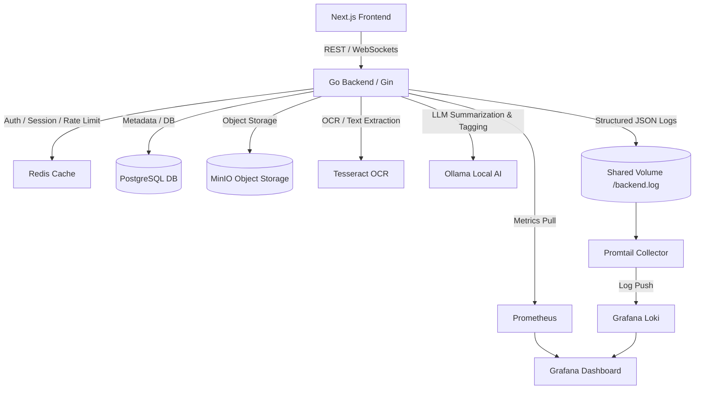

# Distributed Cloud Storage Platform (Dropbox / Google Drive Clone)

A production-grade, highly optimized distributed cloud storage platform built from scratch. This project demonstrates advanced backend engineering (Golang, PostgreSQL, Redis caching, MinIO), responsive frontend interfaces (Next.js, Tailwind CSS, Zustand, React Query), local AI processing (Ollama, Tesseract OCR), and enterprise DevOps/observability (Prometheus, Grafana Loki, Promtail, CI/CD).

---

## 🏗️ Architecture Overview



---

## 🚀 Key Engineering & Architecture Achievements (Resume-Ready)

### 1. Resumable Chunked Uploads & Stream Merging
- Designed a **custom chunked upload manager** that slices large files client-side and uploads chunks concurrently with a configurable queue (concurrency limit = 3), supporting pause/resume.
- Engineered a **zero-local-buffer stream merging system** on the backend using `io.MultiReader` to read chunk parts sequentially from MinIO and pipe them directly into their destination, calculating a SHA-256 hash concurrently via `io.TeeReader`. This prevents backend memory pressure and disk thrashing.

### 2. Cryptographic Content-Addressable Storage (CAS)
- Implemented **file-level deduplication** using SHA-256 file hashing. When duplicate content is uploaded, the database links the new file metadata to the existing S3/MinIO object key, reducing storage footprint by up to 100% for identical files.

### 3. Highly Consistent Cache-Aside Layer
- Built a **cache-aside mechanism** for directory listings in Redis.
- Implemented a **strict invalidation routine**: mutations (uploading, editing, moving, deleting) automatically trigger targeted parent directory invalidations, maintaining zero stale cache reads.

### 4. Local AI Coprocessor Pipeline
- Automated background indexing of documents: triggers a goroutine to extract text from images using **Tesseract OCR**, summarize documents with **Ollama (`qwen2:1.5b`)**, and auto-assign 3-5 tags.
- Enabled **semantic/natural language search** by scanning file names, summaries, OCR outputs, and tags.

### 5. WebSocket Real-Time Notification Server
- Created a thread-safe **WebSocket Hub** in Go that broadcasts system events (e.g. background AI analysis complete, file shares) to connected users with client-side exponential backoff reconnection.

---

## 🛠️ Tech Stack
- **Backend**: Golang (Gin, PGX, MinIO Go SDK)
- **Frontend**: Next.js 14, Tailwind CSS, Zustand, React Query, ShadCN UI
- **Database/Cache**: PostgreSQL (Index-optimized), Redis
- **Storage**: MinIO (S3-compatible API)
- **AI/LLM**: Ollama (`qwen2:1.5b`), Tesseract OCR CLI
- **Monitoring**: Prometheus, Grafana Loki, Promtail, Grafana Dashboards

---

## 📋 System Design Interview Talking Points

1. **How do you handle memory when merging 5GB files?**
   - *Answer*: Traditional servers download all chunks to local disk or memory before uploading. We streams chunks on-the-fly directly from storage back to storage. By chaining Go's `io.Reader` interfaces into a single `io.MultiReader`, we keep heap consumption constant (<50MB) regardless of file size.
2. **How is Cache Invalidation structured?**
   - *Answer*: We use a deterministic key namespace format `dir_cache:user_id:folder_id`. When a resource is modified, we lookup its `folder_id` in Postgres (using transaction `RETURNING` clauses where possible) and execute a synchronous Redis `DEL`. For moving files/folders, we invalidate both source and target folder caches.

---

## 🚀 Getting Started (Run Locally)

### Prerequisites
- Docker & Docker Compose
- Go 1.25+ (if running bare-metal)
- Node.js 20+ (if running bare-metal)

### 1. Launch Services
Start all containers (Postgres, Redis, MinIO, Ollama, Prometheus, Grafana, Loki, Promtail, Go Backend, and Next.js Frontend) using Docker Compose:
```bash
docker compose up -d
```

### 2. Pull AI Models
Enter the Ollama container and download the lightweight model:
```bash
docker exec -it cloudstore_ollama ollama pull qwen2:1.5b
```

### 3. Access the Platforms
- **Frontend App**: [http://localhost:3000](http://localhost:3000)
- **Go API Backend**: [http://localhost:8080](http://localhost:8080)
- **Grafana Monitoring**: [http://localhost:3001](http://localhost:3001) (Credentials: `admin` / `admin`)
- **MinIO S3 Console**: [http://localhost:9001](http://localhost:9001) (Credentials: `minioadmin` / `minioadminpassword`)
